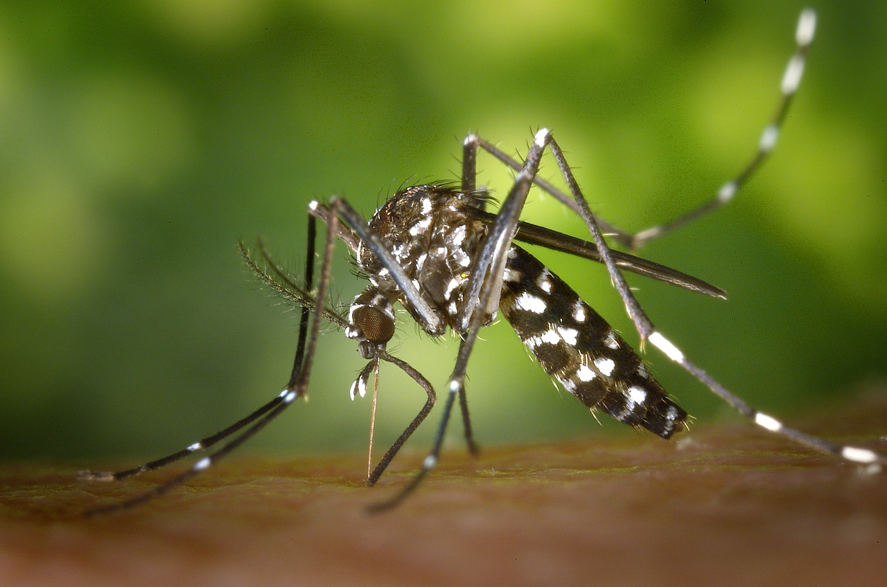

```{r setup, include=FALSE}
options(htmltools.dir.version = FALSE)
knitr::opts_chunk$set(
  fig.width=9, fig.height=3.5, fig.retina=3,
  out.width = "100%",
  cache = FALSE,
  echo = TRUE,
  message = FALSE, 
  warning = FALSE,
  hiline = TRUE
)
```

```{css, echo = FALSE}
h1, #TOC>ul>li {
  color: #3f007d;
  font-weight: bold;
}
h2, #TOC>ul>ul>li {
  color:  #3f007d;
  #font-family:  "Times";
  font-weight: bold;
}
h3, #TOC>ul>ul>li {
  color: #ce1256;
  #font-family:  "Times";
  font-weight: bold;
}
```

```{r xaringan-themer, include=FALSE, warning=FALSE}
library(xaringanthemer)
style_duo_accent(
  primary_color = "#1381B0",
  secondary_color = "#470627",
  inverse_header_color = "#FFFFFF",
  title_slide_background_color = "#051454",
  title_slide_text_color = "#f5ef4c"
)
```

<style type="text/css">
.remark-slide-content {
    font-size: 30px;
    padding: 1em 4em 1em 4em;
}
</style>

## What is Dengue?

.pull-left[

- Viral infection caused by the dengue virus (DENV), transmitted to humans through the bite of infected mosquitoes.

- There is no specific treatment for dengue fever.

- Dengue is a global issue.

]

.pull-right[



]

---
background-image: url(map.png)
background-size: cover

.footnote[Image source: https://www.healthmap.org/dengue/en/]
---
background-image: url(map.png)
background-size: cover

**Prevalent in the tropical regions of the world**


.footnote[Image source: https://www.healthmap.org/dengue/en/]


---

## Favorable environmental conditions

- Temperature:  25 to 30 degrees Celsius (77 to 86 degrees Fahrenheit)

- Humidity: prefer high humidity levels

- Rainfall: require water to lay their eggs and complete their life cycle

- Standing water: lay their eggs in stagnant water sources such as ponds, ditches, water-filled containers, and even discarded tires

- Vegetation: often seek shelter in areas with dense vegetation

---
background-image: url(who1.png)
background-size: cover


---
background-image: url(who2.png)
background-size: cover


---
class: inverse, center

## Small bite -Big threat!


---

# Dengue Research Flow

Step 1: Data collection

Step 2: Data analysis

Step 3: Communication


---

# Dengue Research Flow

**Step 1: Data collection**

Step 2: Data analysis

Step 3: Communication

---
background-image: url(denguehub.png)
background-size: contain

---
class: inverse, center

# Small bite - Big threat!

# Small data - Big impact!


---

## Dengue Data Hub

- Why? ✅

- Where?

- To whom?

- What do we have?

- How to use?

- How to collaborate?

---

# Where?


- Dengue data hub website: https://denguedatahub.netlify.app/

- R package: 

```r
install.packages("denguedatahub")
```

```r
install.packages("devtools")
devtools::install_github("thiyangt/denguedatahub")
```


---


## Dengue Data Hub

- Why? ✅

- Where?  ✅

- To whom?

- What do we have?

- How to use?

- How to collaborate?

---

## To whom

- Researchers

- Teachers

- Epidemiologists

- Public health officials

- Medical practitioners

- National/International health organizations

---


## Dengue Data Hub

- Why? ✅

- Where?  ✅

- To whom?  ✅

- What do we have?

- How to use?

- How to collaborate?

---
# What do we have?


```{r}
library(denguedatahub)
vcdExtra::datasets("denguedatahub")

```

---

### Global level

```{r}
level_of_risk
```

---

```{r}
summary(level_of_risk)
```

---
### Annual incidence (225 countries, from 1990 to 2019)

```{r}
world_annual
```


---

### Sri Lanka

```{r}
srilanka_weekly_data
```

---
### Sri Lanka: District-wise weekly Dengue cases from 2006 to 2023-present

```{r}
visdat::vis_dat(srilanka_weekly_data)
```

---
### China: Annual Dengue Cases from 2005 to 2020

```{r}
china_annual_data
```

---
### Singapore: Weekly Dengue Cases 

```{r}
singapore_weekly_data
```

---


## Dengue Data Hub

- Why? ✅

- Where?  ✅

- To whom?  ✅

- What do we have? ✅

- How to use? ✅

- How to collaborate?

---
### Interactive dashboard

https://denguedatahub.netlify.app/dh.mov


---
### Interactive visualisation

https://denguedatahub.netlify.app/c1_and_c2.mov


---

# How to collaborate

- Add data

- Fix issues

- Documentation

---
class: center, middle

# Thank You!

```{r, echo=FALSE}
anicon::faa("twitter", animate="float", size=3, colour="lightblue")
```

```{r, echo=FALSE}
anicon::faa("github", animate="float", size=3, colour="black")
```

# @thiyangt


### web: https://thiyanga.netlify.app

# email: ttalagala@sjp.ac.lk

